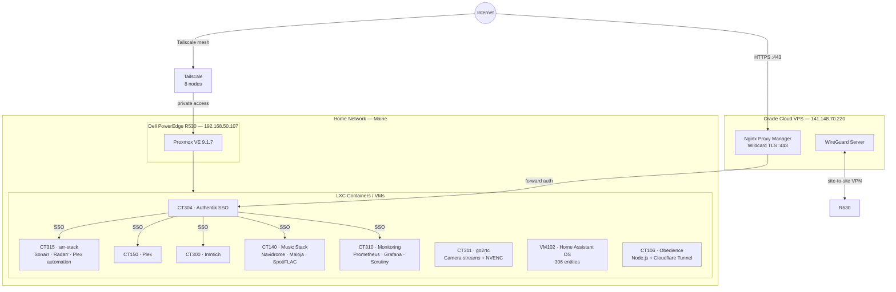

# Homelab

Personal home server infrastructure running 24/7 on enterprise hardware. Designed to replace commercial cloud services for ~15 users, with production-grade practices: VLAN segmentation, SSO on all public endpoints, ZFS storage with redundancy, centralized monitoring, and fully documented operations.

---

## At a Glance

| | |
|---|---|
| **Server** | Dell PowerEdge R530 — Xeon E5-2680 v4, 64 GB ECC DDR4 |
| **Hypervisor** | Proxmox VE 9.1.7 (kernel 6.14.11-6-pve) |
| **Storage** | ZFS RAIDZ1 · ~7.3 TB usable · NVMe transcode cache |
| **Containers** | 10 LXC containers + 2 VMs, ~26 running services |
| **Networking** | UniFi · 3 VLANs · WireGuard site-to-site VPN · Tailscale mesh |
| **Edge** | Oracle Cloud VPS · Nginx Proxy Manager · wildcard TLS |
| **Auth** | Authentik SSO protecting all public endpoints |
| **Photos** | Immich — 193,933 photos + 3,156 videos (2007–2026) |
| **Domain** | `donovanshome.systems` — 12+ subdomains |

---

## Architecture

---

## Hardware

### Primary Server — Dell PowerEdge R530

| Component | Detail |
|-----------|--------|
| CPU | Intel Xeon E5-2680 v4 · 14 cores / 28 threads · 2.4 GHz |
| RAM | 64 GB DDR4 ECC (8× 8 GB DIMMs, expandable to 128 GB) |
| GPU | NVIDIA Quadro P1000 4 GB — passed through to containers via VFIO |
| Storage | See [Storage](#storage) |
| Remote mgmt | Dell iDRAC 8 — out-of-band KVM, IPMI, hardware monitoring |
| OS | Proxmox VE 9.1.7 on kernel 6.14.11-6-pve |
| Idle power | ~98 W |
| CPU temp | 36°C package at idle |

GPU passthrough is configured so CT150 (Plex), CT300 (Immich ML), CT140 (Music), and CT311 (go2rtc) all share NVENC encoding simultaneously without conflicts.

### Edge Node — Oracle Cloud VPS

- Always Free tier ARM instance
- Runs Nginx Proxy Manager as public reverse proxy
- WireGuard server — routes `192.168.50.0/24` via tunnel to R530
- SSH reverse tunnels for services that need non-standard access paths

---

## Networking

> Full detail: [docs/networking.md](docs/networking.md)

Three isolated VLANs managed by Ubiquiti UniFi:

| VLAN | Subnet | Purpose |
|------|--------|---------|
| Main LAN | `10.0.0.0/24` | Workstations, IoT gateway, HA Pi |
| Server VLAN | `192.168.50.0/24` | All Proxmox VMs and containers |
| IoT VLAN | `192.168.20.0/24` | Smart home devices, isolated from LAN |

**VPN / Remote Access:**

- **WireGuard** site-to-site: R530 ↔ Oracle VPS, giving the VPS a route into the server VLAN for reverse proxying without exposing any ports on the home router
- **Tailscale** mesh VPN: 8 nodes (workstation, laptop, phones, HA, VPS) — used for direct private access without going through the public proxy
- **Gluetun** (ProtonVPN WireGuard): VPN kill-switch container in CT315, all torrent/download traffic tunneled with a VPN-monitored watchdog (see [Scripts](#scripts))

**Public DNS / TLS:**

- Domain `donovanshome.systems` managed on Cloudflare
- Wildcard cert `*.donovanshome.systems` via Let's Encrypt DNS-01 challenge, renewed by NPM
- 12 public subdomains, all proxied through NPM on the VPS

| Subdomain | Service |
|-----------|---------|
| `auth.donovanshome.systems` | Authentik SSO |
| `photos.donovanshome.systems` | Immich |
| `music.donovanshome.systems` | Navidrome |
| `ha.donovanshome.systems` | Home Assistant (Hampton site) |
| `homeha.donovanshome.systems` | Home Assistant (Maine server) |
| `stats.donovanshome.systems` | Maloja music stats |
| `sonarr` / `radarr` / `prowlarr` | Arr stack (Authentik protected) |
| `jellyseerr.donovanshome.systems` | Media requests |
| `tautulli.donovanshome.systems` | Plex analytics |

---

## Storage

> Full detail: [docs/storage.md](docs/storage.md)

All storage on R530 is managed by ZFS:

| Pool | Type | Raw | Usable | Used | Contents |
|------|------|-----|--------|------|----------|
| `rpool` | Mirror | 2× 600 GB SAS | 556 GB | 34% | Proxmox OS, VM/CT disks |
| `datapool` | RAIDZ1 | 4× 2 TB SAS | 7.27 TB | ~80% | Media, photos, music, audiobooks |

- `nvme-fast`: Samsung SM961 512 GB NVMe, ext4 — Plex transcode scratch, Immich ML cache, Minecraft world
- ZFS compression on `rpool`: 2.11× ratio
- Drive health monitored via Scrutiny (SMART) with Grafana dashboards
- Current work: expanding `datapool` from 4→5 drives (RAIDZ expansion); one drive flagged for imminent replacement (215 grown defects)

---

## Services

> Full detail: [docs/services.md](docs/services.md)

### Media

| Service | Container | Role |
|---------|-----------|------|
| Plex | CT150 `:32400` | Media server — movies, TV, music |
| Sonarr | CT315 `:8989` | TV show automation |
| Radarr | CT315 `:7878` | Movie automation |
| Prowlarr | CT315 `:9696` | Indexer aggregator |
| Bazarr | CT315 `:6767` | Subtitle automation (OpenSubtitles.com) |
| Jellyseerr | CT315 `:5055` | Plex-integrated request portal |
| Tautulli | CT315 `:8181` | Plex activity analytics |
| Recyclarr | CT315 | TRaSH guides quality profiles synced to Sonarr/Radarr |
| cross-seed | CT315 | Cross-seeding automation |
| FlareSolverr | CT315 | Cloudflare bypass for indexers |
| qBittorrent v5 | CT315 `:8080` | Torrent client (Gluetun VPN kill-switch) |
| Gluetun | CT315 | ProtonVPN WireGuard — port-forward + kill-switch |

### Audiobooks

| Service | Container | Role |
|---------|-----------|------|
| Audiobookshelf | CT315 `:13378` | Audiobook server + streaming player |
| ReadMeABook | CT315 `:3031` | Custom audiobook request UI (replaces Readarr) |

### Photos

| Service | Container | Role |
|---------|-----------|------|
| Immich | CT300 `:2283` | Self-hosted Google Photos replacement |

193,933 photos + 3,156 videos spanning 2007–2026. GPU-accelerated ML for face recognition and CLIP search.

### Music

| Service | Container | Role |
|---------|-----------|------|
| Navidrome | CT140 `:4533` | Self-hosted Subsonic-compatible music server |
| Maloja | CT140 `:42010` | Last.fm-compatible scrobbling + stats |
| SpotiFLAC | CT140 | Spotify → FLAC downloader via Deemix |

### Home Automation

| Service | Container | Role |
|---------|-----------|------|
| Home Assistant OS | VM102 | Primary automation hub — 306 entities |
| go2rtc | CT311 | Camera stream relay, NVENC hardware transcode |
| MQTT | `10.0.0.1:1883` | IoT messaging broker (gateway-hosted) |

306 HA entities covering smart lighting (Nanoleaf, TP-Link), climate, presence detection, media players, and camera integration. Custom Lovelace dashboard with 7 views.

### Infrastructure

| Service | Container | Role |
|---------|-----------|------|
| Authentik | CT304 `:9000` | SSO / identity provider — OIDC + forward auth |
| Nginx Proxy Manager | VPS | Public reverse proxy + TLS termination |
| Tailscale | host-level | Mesh VPN — 8 devices |
| WireGuard | host-level | Site-to-site VPN to Oracle VPS |
| Syncthing | host-level | Obsidian vault sync (PC ↔ R530) |
| Samba | host-level | SMB shares from datapool |
| Monitoring Stack | CT310 | Prometheus + Grafana + Scrutiny + PVE exporter |
| Homepage | CT315 `:3000` | Unified dashboard, 26 services, 14 live API widgets |
| Watchtower | CT315 | Automated container image updates |
| Minecraft | CT305 `:25565` | Java survival server (Temurin 25 JDK, Aikar's flags) |
| Obedience | CT106 | Node.js app + Cloudflare Tunnel |

---

## Monitoring

> Full detail: [docs/monitoring.md](docs/monitoring.md)

CT310 runs the full Prometheus + Grafana + Scrutiny stack:

- **Prometheus** scrapes: PVE exporter, node_exporter (per-host), container-level metrics
- **Grafana** dashboards: Proxmox cluster health, per-container CPU/RAM/network, ZFS pool status
- **Scrutiny** aggregates SMART data across all 6 drives with pass/fail thresholds
- **Grafana Loki** (planned) for log aggregation

Homepage dashboard aggregates live API data from Proxmox, Immich, Sonarr, Radarr, Tautulli, Scrutiny, Jellyseerr, Navidrome, and others — 14 widgets across 5 tabs.

---

## Authentication

All public services are protected by Authentik forward auth. The flow:

1. Request hits NPM on VPS → NPM checks Authentik forward auth endpoint
2. If not authenticated → redirect to `auth.donovanshome.systems`
3. Authentik issues session → NPM proxies to backend service

Authentik embedded outpost runs inside CT304. 5 forward-auth providers cover the arr stack; Immich and Navidrome use their own native auth. Jellyseerr uses Plex OAuth directly.

---

## Scripts

> Source: [scripts/](scripts/)

### VPN Watchdog (`vpn-watchdog.sh`)

Gluetun silently fails port-forward renewal (ProtonVPN NAT-PMP can refuse on token expiry), leaving the forwarded port stuck at `0`. This causes download clients to stop receiving connections without any visible error.

The watchdog runs every 5 minutes via cron on CT315:
- Polls Gluetun's internal API for the forwarded port
- Two consecutive `port=0` reads → triggers automatic recovery
- Restarts `gluetun` → waits for VPN reconnect → restarts `qbittorrent` + `qb-port-sync`
- Refreshes the tracker keep-alive
- Logs all events with timestamps to `/var/log/vpn-watchdog.log`
- Max undetected downtime reduced from 36+ hours to ~10 minutes

### Job Alert Bot (`howelllabs-watcher`)

Hourly cron on the PVE host. Polls Howelllabs Engineering job listings and fires a Discord webhook notification when new electrical engineering postings appear. Zero dependencies beyond `curl` and `jq`.

---

## Home Automation

> Full detail: [docs/home-automation.md](docs/home-automation.md)

Two Home Assistant instances:
- **VM102** (Maine, `192.168.50.111`): primary server-VLAN instance
- **HA Pi** (Hampton, `10.0.0.155`): Raspberry Pi 4, secondary site + Tailscale exit node

306 entities across integrations: TP-Link smart plugs/switches, Nanoleaf LED panels, Chromecast media players, ASUS router presence detection, Apple device tracking, climate sensors, 2× Tapo cameras (relayed via go2rtc/NVENC to HA).

Custom Lovelace dashboard ("My Home") with 7 views: Overview, Lights, Climate, Media, Cameras, Energy, Presence.

---

## Architecture Decisions

> Full detail: [docs/decisions.md](docs/decisions.md)

| Date | Decision | Status |
|------|----------|--------|
| 2026-05-31 | Replace Readarr + Bookworm with ReadMeABook for audiobook automation | Active — parallel validation |
| 2026-05-29 | Expand datapool via RAIDZ expansion (add drive 5) before buying new hardware | Active |
| — | WireGuard site-to-site to Oracle VPS instead of direct port forwarding | Active |
| — | Authentik SSO with forward auth vs per-service OAuth | Active |

---

## Roadmap

> Full detail: [docs/roadmap.md](docs/roadmap.md)

5-phase plan to replace all remaining commercial services for ~15 users, targeting ~335 TiB total storage:

| Phase | Focus | Est. Cost | Timeline |
|-------|-------|-----------|----------|
| 1 | Drive replacement (sde, 215 defects) + rpool SSD migration | ~$65 | Now |
| 2 | 8× 8 TB RAIDZ1 expansion + NDS-4600 JBOD (109 TiB) + LSI HBA + UPS | ~$2,400 | 1–3 mo |
| 3 | RTX A2000 12 GB + 64→128 GB RAM upgrade | ~$750 | 2–4 mo |
| 4 | Vaultwarden, Headscale, Nextcloud, Kavita, Lidarr, Uptime Kuma | $0 | 3–6 mo |
| 5 | RAIDZ2 second pool, 10 GbE, second server, OPNsense | ~$2,000 | 6–12 mo |

**Endgame target:** Dell R530 (~44 TiB RAIDZ2) + Sun NDS-4600 60-bay JBOD (~291 TiB at 8 TB drives) = **~335 TiB** total usable.

---

## Documentation

This entire homelab is backed by a structured Obsidian wiki (~50 pages) covering:
- Service documentation with port maps, API references, and troubleshooting history
- Architecture Decision Records for every major technical choice
- Incident reports with root cause analysis and fix verification
- An append-only operation log for all infrastructure changes
- A hot-cache context file kept current after every significant change

Operations follow a consistent pattern: any change is logged, any incident gets a root cause writeup, any decision that wasn't obvious gets an ADR.
