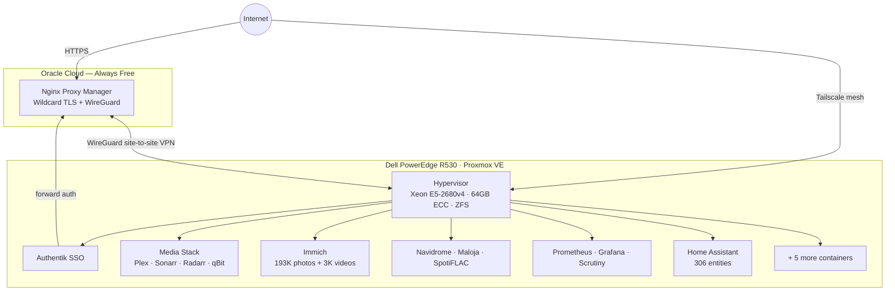

# Homelab

Personal home server stack built to replace commercial cloud services for ~15 users. Runs 24/7 on enterprise hardware with production-grade practices: VLAN segmentation, centralized SSO, ZFS redundant storage, full monitoring, and documented operations.

---

## Hardware

| Component | Detail |
|-----------|--------|
| **Server** | Dell PowerEdge R530 — enterprise 2U rack server |
| **CPU** | Intel Xeon E5-2680 v4 · 14 cores / 28 threads |
| **RAM** | 64 GB DDR4 ECC (expandable to 128 GB) |
| **GPU** | NVIDIA Quadro P1000 — passed through to multiple containers simultaneously via VFIO |
| **Remote mgmt** | Dell iDRAC 8 — out-of-band KVM, IPMI, hardware monitoring |
| **Hypervisor** | Proxmox VE 9.1.7 · 10 LXC containers + 2 VMs |
| **Storage** | ZFS RAIDZ1 · ~7.3 TB usable · NVMe transcode cache |
| **Edge node** | Oracle Cloud VPS (Always Free) |
| **Networking** | Ubiquiti UniFi · 3 VLANs |

---

## Architecture

**Key design decisions:**

- Zero open ports on the home router — all public traffic routes through a WireGuard tunnel to an Oracle Cloud VPS, where Nginx Proxy Manager handles TLS termination and reverse proxying
- Tailscale mesh VPN (8 nodes) for direct private access without the public proxy
- Authentik SSO with NPM forward auth gates all public-facing services — one IdP, one login session
- Gluetun VPN kill-switch container routes all download traffic through ProtonVPN WireGuard; if the tunnel drops, traffic stops rather than leaking

---

## Services

### Media

Built a fully automated media pipeline: indexers pull from multiple sources via Prowlarr, Sonarr and Radarr manage TV and movie libraries, qBittorrent runs behind a ProtonVPN kill-switch, and Recyclarr syncs TRaSH-guide quality profiles automatically. Hardlinks between the download path and Plex library mean zero storage duplication. Jellyseerr provides a Plex-integrated request portal for family members.

| Service | Role |
|---------|------|
| Plex | Media server with NVENC hardware transcode |
| Sonarr / Radarr | TV and movie library management |
| Prowlarr | Indexer aggregation |
| Bazarr | Subtitle automation |
| Jellyseerr | Family request portal |
| Tautulli | Plex analytics |
| Recyclarr | Quality profile sync from TRaSH guides |
| qBittorrent v5 | Torrent client (ProtonVPN kill-switch) |
| cross-seed | Cross-seeding automation |

### Audiobooks

Deployed and debugged ReadMeABook — a newer audiobook automation tool that integrates Prowlarr, qBittorrent, and Audiobookshelf natively. Tracked down and fixed three path configuration bugs in the service database (the admin API requires Plex session auth, so fixes had to go directly into SQLite). Running in parallel with the existing Readarr stack during validation before full cutover.

### Photos

Immich self-hosted photo library: 193,933 photos + 3,156 videos spanning 2007–2026. GPU-accelerated ML for face recognition and CLIP semantic search.

### Music

Navidrome (Subsonic-compatible) serves a FLAC music library. Maloja scrobbles listening history and generates charts/statistics. SpotiFLAC handles Spotify-to-FLAC acquisition.

### Home Automation

Two Home Assistant instances (primary server + Raspberry Pi 4 at a second physical site). 306 entities across TP-Link smart plugs, Nanoleaf LED panels, Chromecast media players, ASUS presence detection, Apple device tracking, climate sensors, and 2 IP cameras. Custom Lovelace dashboard with 7 views. go2rtc relays camera streams with NVENC hardware transcode.

### Infrastructure

| Service | Role |
|---------|------|
| Authentik | SSO / identity provider — OIDC + forward auth |
| Nginx Proxy Manager | Public reverse proxy + wildcard TLS termination |
| Prometheus + Grafana | Metrics and dashboards |
| Scrutiny | SMART drive health monitoring across all drives |
| Syncthing | Obsidian vault sync between workstation and server |
| Homepage | Unified dashboard — 26 services, 14 live API widgets |
| Watchtower | Automated container image updates |

---

## Notable Work

### VPN Watchdog ([scripts/vpn-watchdog.sh](scripts/vpn-watchdog.sh))

ProtonVPN's NAT-PMP port-forward renewal can silently fail — the forwarded port drops to `0` with no error in logs or UI, and download clients stop receiving connections indefinitely. This caused a 36-hour undetected outage.

Wrote a watchdog script that runs every 5 minutes, polls Gluetun's internal API, and triggers an automatic recovery sequence on two consecutive failures: restart the VPN container, wait for reconnect, restart the download stack. Max undetected downtime reduced from 36+ hours to ~10 minutes.

### ReadMeABook Debugging

Diagnosed three separate path configuration bugs that prevented the audiobook pipeline from functioning. The service's admin API requires active Plex session authentication, so the fixes had to be applied directly to the backing SQLite database. Verified each downstream connection (indexer, download client, media server) individually after the fix.

### Homelab Wiki

The entire homelab is documented in a structured Obsidian wiki (~50 pages): service docs with troubleshooting history, Architecture Decision Records for every non-obvious technical choice, an append-only operation log for all infrastructure changes, and incident reports with root cause analysis. Synced live between the server and workstation via Syncthing.

---

## Networking

- **3 VLANs** via UniFi: workstations, servers, IoT (IoT devices cannot reach the server subnet)
- **WireGuard site-to-site**: outbound tunnel from server to Oracle VPS — gives the VPS a route into the server subnet without any inbound firewall rules on the home router
- **Tailscale mesh**: 8 nodes for direct private access
- **Cloudflare** DNS + wildcard Let's Encrypt cert on the public domain, auto-renewed via DNS-01 challenge

---

## Storage

- **ZFS RAIDZ1** for media and data: single-parity redundancy, checksumming for silent corruption detection, LZ4 compression (2.11× ratio on OS pool)
- **ZFS mirror** for OS and VM disks
- **NVMe scratch** for transcode and ML cache
- Drive health monitored via Scrutiny with Grafana dashboards
- Currently mid-RAIDZ expansion (4→5 drives) — online, no downtime, native OpenZFS 2.2 feature
- One drive flagged for replacement (215 grown defects) — queued after expansion completes

---

## Roadmap

5-phase plan toward ~335 TiB total storage and full commercial-service replacement:

| Phase | Focus | Est. Cost |
|-------|-------|-----------|
| 1 | Drive replacement + rpool SSD migration | ~$65 |
| 2 | 8× 8 TB expansion + 60-bay JBOD (Sun NDS-4600) + UPS | ~$2,400 |
| 3 | RTX A2000 12 GB + 128 GB RAM | ~$750 |
| 4 | Vaultwarden, Headscale, Nextcloud, Kavita, Lidarr, Uptime Kuma | $0 |
| 5 | RAIDZ2, 10 GbE, second server, OPNsense | ~$2,000 |

See [docs/roadmap.md](docs/roadmap.md) for full detail.
